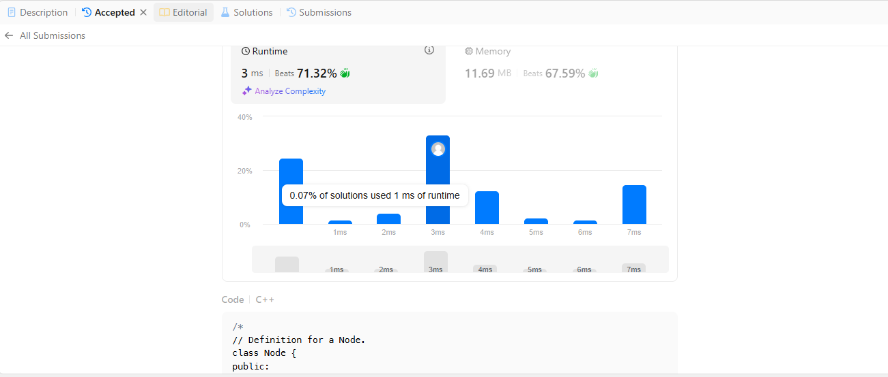
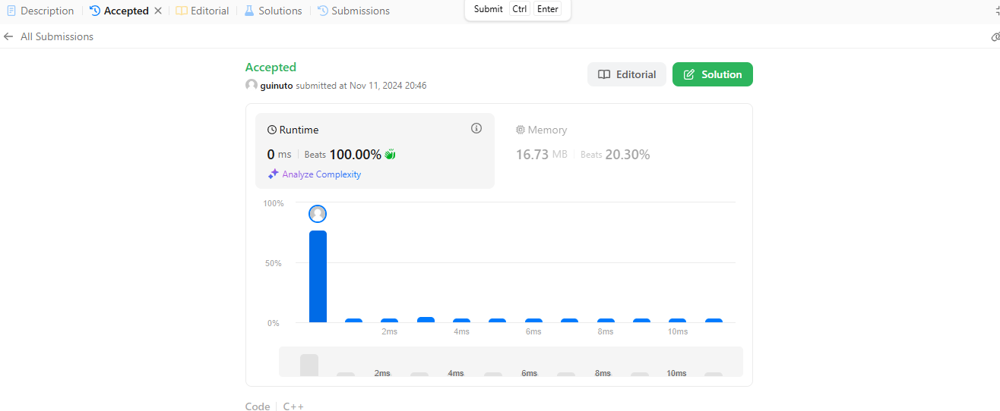
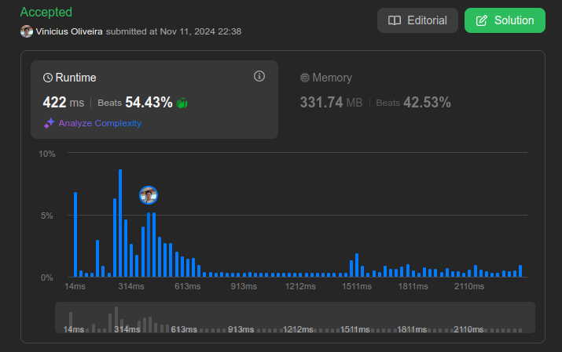

Temas:
 - Grafos1

# QuestionsJuizOnline

**Número da Lista**: 1
**Conteúdo da Disciplina**: Grafos

## Alunos
|Matrícula | Aluno |
| -- | -- |
| 20/0038028  |  Guilherme Evangelista Ferreira dos Santos |
| xx/xxxxxx  |  xxxx xxxx xxxxx |

## Sobre 
Resolvemos 4 questões de juiz online no site [LeetCode](https://leetcode.com/) . 

1.[133](https://leetcode.com/problems/clone-graph/description/) Clone Graph (Medium)

2.[785](https://leetcode.com/problems/is-graph-bipartite/description/) Is Graph Bipartite (Medium)

3.[997](https://leetcode.com/problems/find-the-town-judge/description/) Find the town Judge (Easy)

4.[1971](https://leetcode.com/problems/find-if-path-exists-in-graph/description/) Find if Path Exists in Graph (Easy)

5.[841](https://leetcode.com/problems/keys-and-rooms/description/) Keys and Rooms (Medium)

## Screenshots

- 133

- 785

-997

-1971

-841

## Uso 
Caso queira rodar é só colocar o código no leetcode ou botar casos de teste na main do arquivo.

## Vídeo 

[Link para o video das questões 133 , 785 e 997](https://youtu.be/gWTfvAHUpj0)